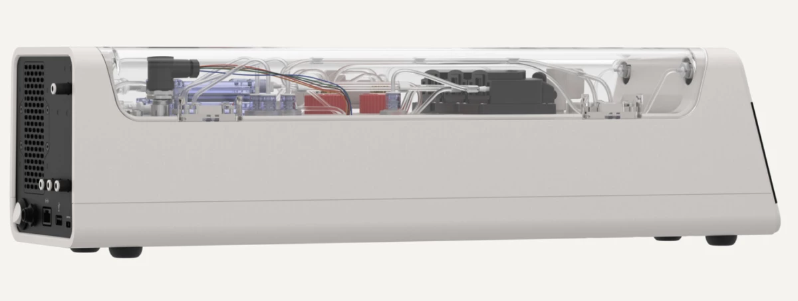
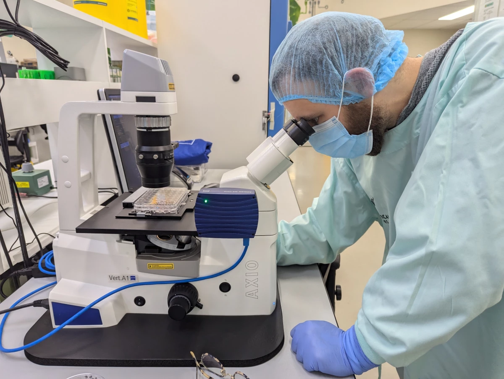
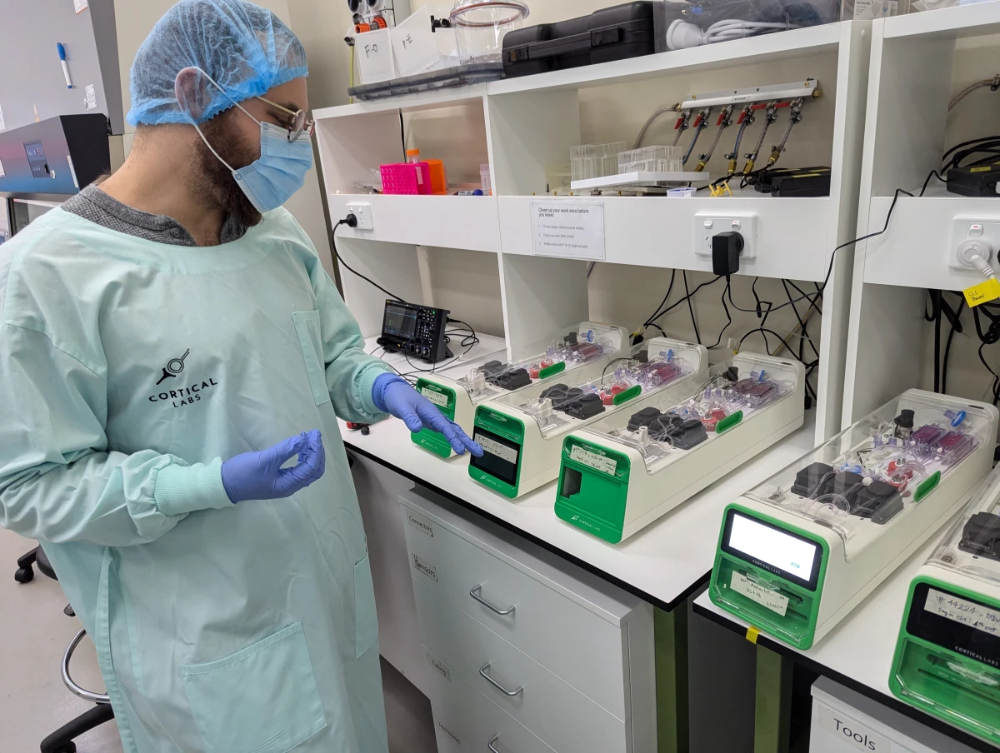
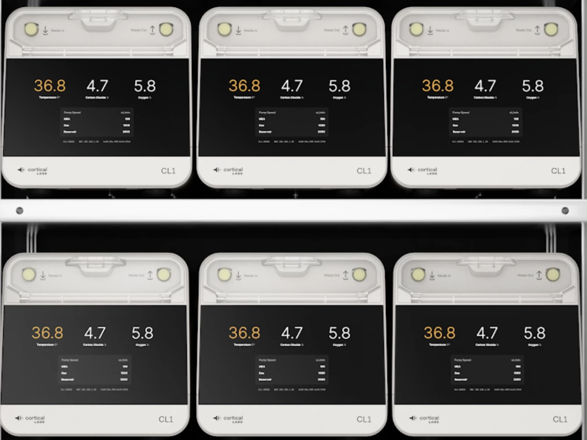
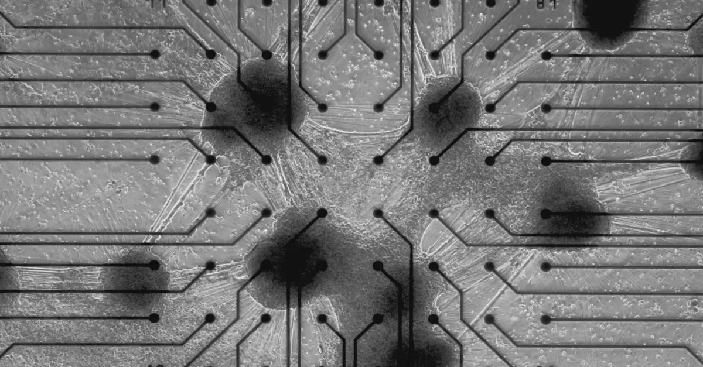
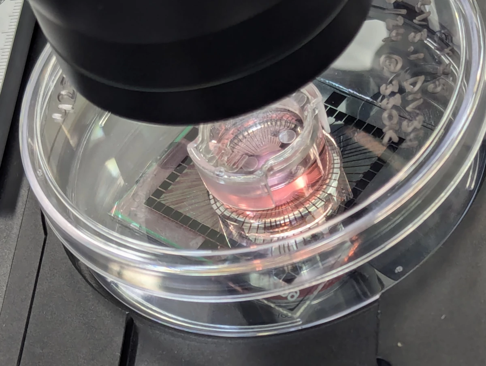
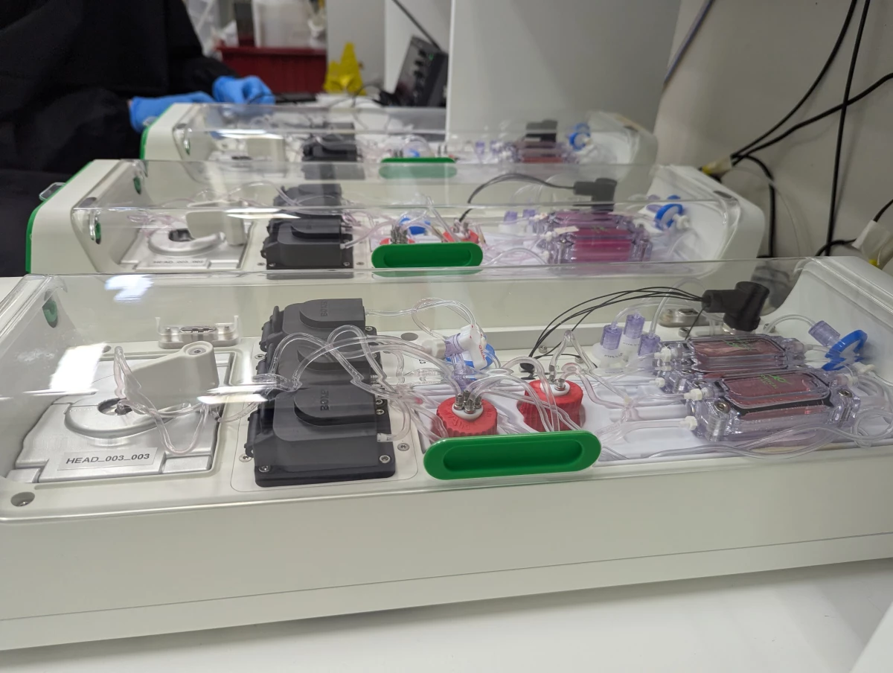

## I. Brain in a Vat: CL1 Requires No External Computer

The world's first "biological computer" has been commercially launched, merging human brain cells with silicon hardware to form fluid neural networks, marking a new era in AI technology. Australian company Cortical Labs' CL1 offers a completely new form of computational intelligence—more dynamic, sustainable, and energy-efficient than any existing AI—whose potential we'll see unfold in users' hands in coming months.

Dubbed Synthetic Biological Intelligence (SBI), Cortical's CL1 system officially launched in Barcelona on March 2, 2025, and is expected to be a game-changer for scientific and medical research. The human cell neural networks formed on silicon "chips" are essentially evolving organic computers that learn so rapidly and flexibly they completely surpass silicon-based AI chips used to train current large language models (LLMs) like ChatGPT, according to the engineers behind them.

"Today marks the culmination of Cortical Labs' vision that has been nearly six years in the making," said Dr. Hon Weng Chong, founder and CEO of Cortical. "We've achieved a series of critical breakthroughs in recent years, most notably our research published in Neuron where we grew cells in a simulated game world with electrophysiological stimulation and recording to mimic the arcade game Pong. However, our long-term mission has always been to democratize this technology and make it accessible to researchers without specialized hardware and software. CL1 is the product of that mission." He added that while this is a groundbreaking advancement, the full potential of SBI systems will only be realized when in users' hands.

## II. Brain in a Vat: Life Support System and Brain Chips

"We're offering 'Wetware as a Service' (WaaS)," he added—customers can either purchase CL-1 biological computers outright or simply buy chip usage time, accessing them remotely via the cloud to collaborate with cultured cell technology. "This platform will enable millions of researchers, innovators, and thinkers worldwide to translate CL1's potential into tangible real-world impact. We'll provide them with both the platform and funding support to invest in R&D and drive new breakthroughs."

These remarkable brain cell biocomputers have the potential to revolutionize everything from drug discovery and clinical trials to building robotic "intelligence," enabling infinite personalization on demand. CL1 will be widely available in the second half of 2025, representing a monumental achievement for Cortical—as New Atlas recently witnessed during a visit to the company's Melbourne headquarters—where the potential extends far beyond Pong.

The team made international headlines in 2022 by developing an adaptive computer "brain" that placed 800,000 human and mouse neurons on a chip and trained this network to play video games. New Atlas readers may already be familiar with Cortical Labs and its gradual progression toward SBI, with Loz Blain having reported on early developments of this adaptive neural network capable of adjusting and adapting to form new, stimulus-responsive information processing pathways.

Chief Scientific Officer Brett Kagan told Blain in 2023: "We almost consider it a different life form, like an animal or human. We view this as a mechanical and engineering approach to intelligence. We're using biological neurons as the substrate for intelligence but assembling them in novel ways."

Since that pivotal step, Cortical Labs has come a long way, but the now-retired DishBrain has become obsolete both technologically and nominally. Now, with CL1's commercialization, researchers can get hands-on with the technology and begin exploring broad real-world applications.

Late last year, when New Atlas journalists visited Kagan and his team at Cortical Labs' Melbourne headquarters, we witnessed firsthand how much biotechnology has advanced since DishBrain. CL1 features relatively simple, stable hardware with new methods to optimize "wetware"—human brain cells—and represents significant progress toward building a neural network that functions like a complete brain. Or, as Kagan explains the ongoing "minimum viable brain" project.

## III. Brain in a Vat: Stimulus Response

 responses in the lab - New Atlas")

In 2022, the team demonstrated how to electrically stimulate mouse and human induced pluripotent stem cells (hiPSCs) in high-density microelectrode arrays (HD-MEAs) based on complementary metal-oxide-semiconductor (CMOS) technology to form autonomous, efficient information exchange pathways.

To achieve this, they needed a method to reward brain cells exhibiting desired behaviors and punish them when failing tasks. The DishBrain experiment proved predictability is key—neurons seek connections producing efficient, predictable outcomes and will adjust their networks to pursue such rewards while avoiding behaviors generating random, chaotic electrical signals.

But as Kagan explained, that was just the beginning.

"The current version is completely different technology," Kagan told Blain and me. "The previous one used something called a CMOS chip, which basically gives you very high-density reading but is opaque—you can't see the cells. There were other issues too—like when you stimulate with CMOS chips, you can't extract charge; you also can't balance charge well. The result was massive charge buildup where prolonged stimulation occurred, which is very bad for cells."

"With these versions, they're simpler technology, but that means they're more stable, and you can more actively balance charge," he added. "When you input two microamps of current, you can extract two microamps. And you can maintain stability for much longer."

## IV. Brain in a Vat: Lab-Grown Stem Cells

In the CL1 system, lab-grown neurons are placed on planar electrode arrays—or, as Kagan explains, "basically metal and glass." Here, 59 electrodes form a more stable network foundation, giving users highly controlled activation of neural networks. This SBI "brain" is then placed in rectangular life-support units connected to software systems for real-time operation.

The perfusion loop components serve as the cells' life-support system—featuring waste filtration, temperature control, gas mixing, and pumps to maintain circulation.

In the lab, Cortical is assembling these units to build an unprecedented biological neural network server stack containing 30 individual units, each housing cells on electrode arrays, expected to go online in coming months.

The team aims to have four such stacks operational and commercially available via cloud systems by year-end. The units themselves are expected to start at around $35,000 (current comparable technology costs approximately €80,000 or nearly $85,000).

The entire CL1 unit consumes about 850-1,000 watts, is fully programmable, and provides "bidirectional stimulation and read interfaces designed to enable neural communication and network learning," the team noted in their launch statement. Incredibly, CL1 units also require no external computer to operate.

## V. Brain in a Vat: Living Cells on Silicon Hardware

The complex, evolving SBI neural networks—visible under microscopes branching from electrode to electrode—initially show potential to revolutionize drug discovery and disease modeling research approaches.

"Our goal is to significantly reduce pricing, and we do want to lower costs long-term, but that's a more distant target," Kagan said. "Meanwhile, we're providing access via cloud systems to anyone, anywhere, any household."

"So even if you don't have one of these [units]," he added, "you can access one from home."

Kagan gave us a tour of the Physical Containment Level 2 (PC2) lab—housing both computer hardware and more traditional biological specimens and equipment. Under microscopes, he showed us some crucial induced pluripotent stem cells (iPSCs). Cultured from blood samples, these cells are essentially blank canvases that can grow into different cell types.

"What we do is take these cells and begin differentiating them using two different methods," he explained. "One approach applies small molecules—called developmental differentiation protocol—where we essentially try to mimic molecules present during in-utero or fetal brain development. The other method directly differentiates them by selectively upregulating specific genes involved in neurons."

One team method is fast and produces high cell purity, but the drawback is it doesn't fully represent the human brain.

"The brain isn't a high-purity organ; it has many different cell types and connections," Kagan said. "So if you only have one cell type, you might have that type, but you don't have a brain."

## VI. Brain in a Vat: Active Cells in Each Unit

The second method, "small molecule approach," produces diverse cell populations but often leaves uncertainty about what exactly is being studied. Understanding this is crucial for Cortical's ambitious pursuit of building a minimum viable brain. While CL1's launch is step one, the team is also working on SBI's second phase.

"You can categorize major cell types, but there are always many subtypes—which is great, as we've found, but we really want controlled direct differentiation," he explained. "We just haven't solved this yet: what is a 'minimum viable brain?'"

The concept of pluripotent stem cells (MVB) is fascinating: how to bioengineer a "brain" resembling the human brain while minimizing extraneous cell differentiation yet achieving complexity beyond homogeneous cell-type neural networks. Such a tool would be a powerful model for more precise and nuanced analysis than current real-brain studies.

"Fundamentally, the key biological component is enabling something to process information dynamically and responsively based on underlying principles," Kagan explained. "A single neuron can do many things—while it can respond to some level of dynamic behavior, it can't, say, navigate environments. The smallest functional brain we know has 301 or 302 neurons—depending who you ask—in C. elegans. But each neuron is highly specialized."

## VII. Brain in a Vat: Brain Cell Input/Output on Silicon Chips

"Another question: Is C. elegans' brain the minimum viable brain? Do you need all neurons, or could you achieve it with 30 uniquely connected neurons?" he continued. (The organism is, of course, science's favorite nematode, Caenorhabditis elegans.) If so, could you build a more complex network with 100,000 identical sets of 30? We don't yet know these answers, but this technology can reveal them.

"We're progressively adding more cell types to these cultures, but one thing holding us back has been tools," he said. "Before building [CL1] units, they didn't exist. You need tools like these to answer questions like, 'What is the minimum viable brain?' With 120 units, you can run tightly controlled experiments to determine exactly what drives emergent intelligence. You could break it down to transcriptome and gene levels to identify which genes and proteins actually enable one person to learn while another doesn't. With all these units, you could immediately adopt approaches for drug discovery and disease modeling."

This is particularly important for researching better treatments or even cures for brain disorders like epilepsy and Alzheimer's, among others. Meanwhile, the CL1 system promises significant advances in disease and treatment research.

"Most neuropsychiatric drugs entering clinical trials fail because the brain's problems are far more complex—but with these tools, you can actually see that complexity," he explained. "We hope to replace much animal testing with these tools. Unfortunately, animal testing remains necessary, but I believe it can be replaced in many cases—which is ethically positive."

Ethical considerations have been a focal point for Cortical—their groundbreaking 2022 paper sparked extensive debate, particularly regarding human "consciousness" and "sentience." While they've implemented as many safeguards as possible to regulate ethical CL1 unit use and remote WaaS access, much work remains.

## VIII. Brain in a Vat: AI Composed of Brain Cells

"Depending on location and specific use cases, numerous regulatory approvals are required," the team noted in their launch statement. "Regulatory bodies may include health agencies, bioethics committees, and government agencies overseeing biotechnology or medical devices. Compliance is crucial to ensure responsible and ethical biocomputing technology use."

As global leaders in this ambitious technology, Cortical recognizes—like rapid non-biological AI development—predicting SBI's broad applications isn't easy. Another challenge is funding—making CL1 a viable technology could change that.

"One difficulty I keep hearing from investors is that we don't fit any category," Kagan told us after removing his lab coat, hairnet, and mask, moving to a couch near upstairs computer rooms. "We're not—we're a technology spanning multiple boundaries. Looking at priority areas, we can enable everything from biotech to robotics to medical sciences. We're neither AI nor medicine—we can do both, but we're neither. So we're often excluded."

## IX. Brain in a Vat: Life Support Inside CL1 Units

Thus, launching physical CL1 systems and Cortical's cloud-based WaaS remote access is a monumental achievement, and Kagan's team is excited to see how far SBI can go once in users' hands.

"CL1 is the first commercialized biological computer uniquely designed to optimize communication and information processing with in-vitro neural cultures," the team stated. "With built-in life support to maintain cell health, CL1 holds significant potential in medical science and technology."

"SBI is inherently more natural than AI because it leverages the same biological material—neurons—as biological intelligence," Cortical added. "By using neurons as computational substrate, SBI may create intelligence forms that appear more organic and natural compared to traditional silicon-based AI."

>Source: Cortical Labs  
>Original link: https://newatlas.com/brain/cortical-bioengineered-intelligence/