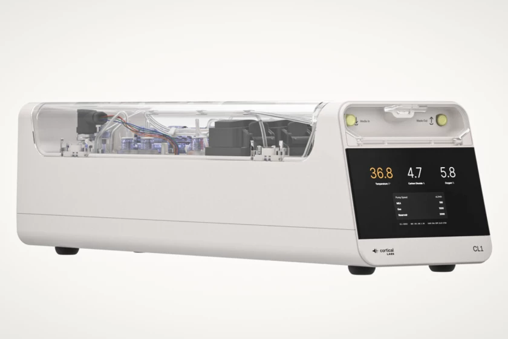
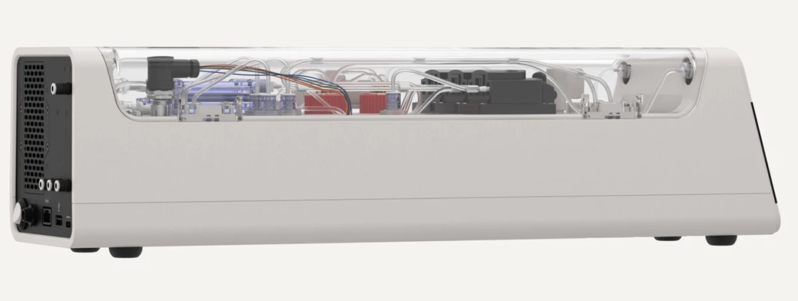
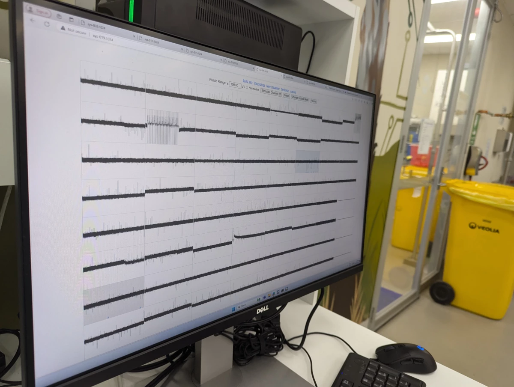
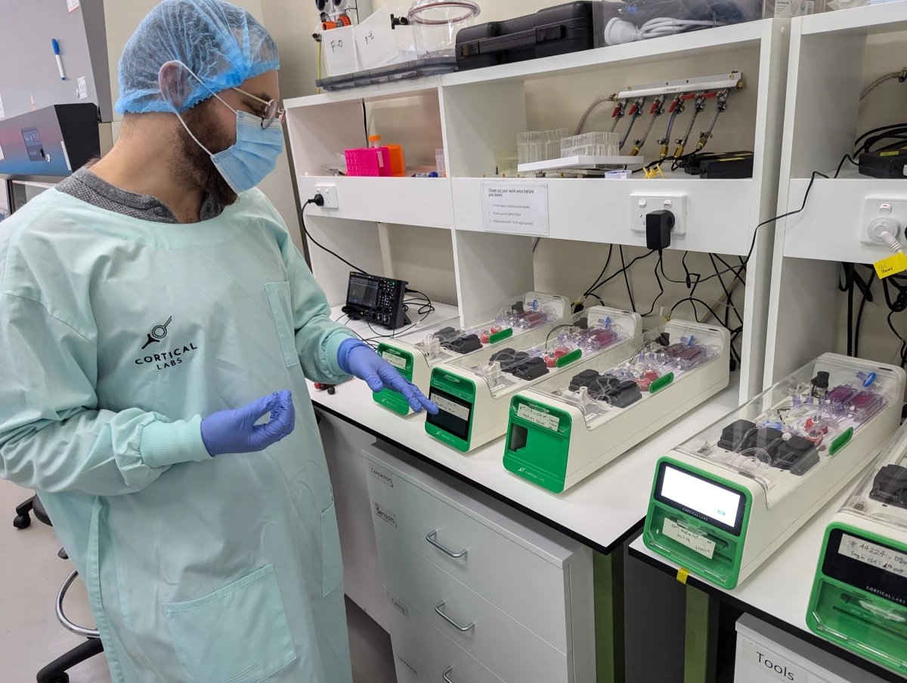
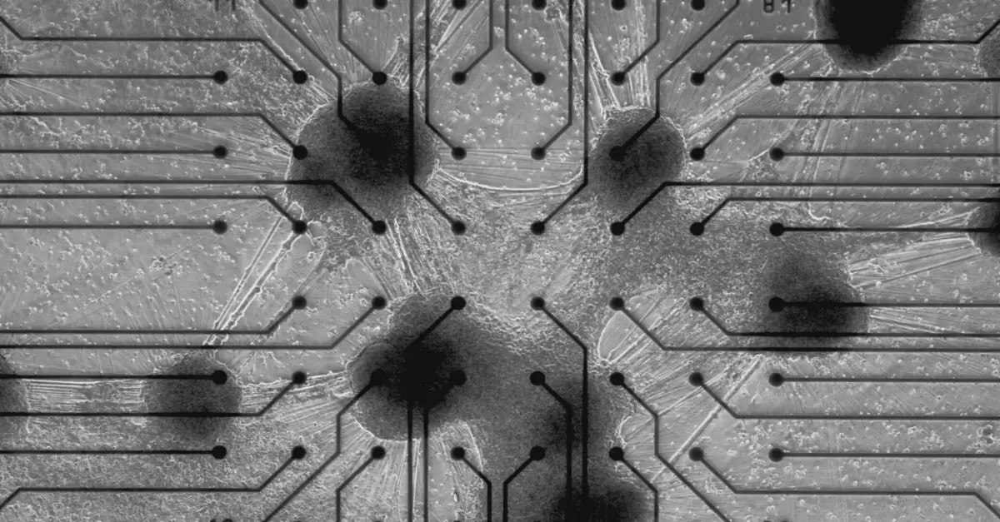

## 一、缸中之脑：CL1不需要外部的计算机

世界上第一台“生物计算机”已经商业推出，它融合了人类大脑细胞与硅硬件以形成流动的神经网络，标志着人工智能技术进入了一个新时代。澳大利亚公司Cortical Labs推出的CL1提供了一种全新的计算智能——一种比目前存在的任何AI都更动态、可持续和节能的智能——我们将在未来几个月内看到它在用户手中的潜力。

被称为合成生物智能（SBI）的Cortical公司的CL1系统于2025年3月2日在巴塞罗那正式推出，预计将成为科学和医疗研究的游戏规则改变者。在硅“芯片”上形成的人细胞神经网络本质上是一个不断进化的有机计算机，其背后的工程师表示，它学习得如此迅速和灵活，以至于完全超越了用于训练现有大型语言模型（LLMs）如ChatGPT的基于硅的AI芯片。

“今天是Cortical Labs愿景的顶峰，这个愿景已经持续了将近六年，”Cortical创始人兼首席执行官Hon Weng Chong博士说。“近年来我们经历了一系列关键突破，最显著的是我们在《Neuron》期刊上的研究，通过这项研究，我们让细胞在模拟的游戏世界中生长，并提供电生理刺激和记录来模仿街机游戏《Pong》。然而，我们的长期使命一直是使这项技术民主化，让没有专业硬件和软件的研究人员也能接触到它。CL1就是实现这一使命的产物。”他补充说，虽然这是一个开创性的进步，但只有在用户手中使用时，才能看到SBI系统的全部潜力。

## 二、缸中之脑：生命支持系统与脑芯片

“我们正在提供‘软件即服务’（WaaS），”他补充说——客户可以直接购买CL-1生物计算机，或者简单地购买芯片使用时间，通过云端远程访问它们来与培养细胞技术合作。“这个平台将使全球数百万研究人员、创新者和思想家能够将CL1的潜力转化为切实的现实世界影响。我们将为他们提供平台和资金支持，以投资于研发并推动新的突破和研究。”

这些非凡的大脑细胞生物计算机有可能彻底改变从药物发现和临床试验到机器人“智能”构建的一切，根据需求实现无限个性化。CL1将于2025年下半年广泛上市，对于Cortical来说是一个巨大的成就——正如《新地图》最近在访问该公司墨尔本总部时所看到的——这里的潜力比《乒乓》要深远得多。

该团队在2022年开发了一个自适应计算机“大脑”，通过将80万个人类和老鼠神经元放置在芯片上，并训练这个网络玩视频游戏，从而登上了国际头条。新阿特拉斯的读者可能已经熟悉Cortical Labs及其向SBI的逐步发展，洛兹·布莱恩曾报道了这个能够调整和适应以形成新的、对刺激响应的信息处理路径的自适应神经网络的早期进展。

首席科学官布雷特·卡根（Brett Kagan）在2023年告诉布莱恩：“我们几乎将其视为一种不同的生命形式，比如说动物或人类。我们认为这是一种机械和工程方法来处理智能。我们正在使用生物神经元作为智能的基底，但我们以新的方式组装它们。”

自那重要的一步以来，Cortical Labs已经走了很长一段路，但如今已不再使用的DishBrain在技术和名称上都已经过时。现在，随着CL1的商业化，研究人员可以亲自接触这项技术，并开始探索广泛的真实世界应用。

去年年底，当《新地图》杂志的记者们在Cortical Labs墨尔本总部访问了Kagan及其团队时，我们亲眼目睹了自DishBrain以来生物技术取得了多么大的进步。CL1配备了相对简单的、稳定的硬件，采用了新的方法来优化“湿件”——人类脑细胞——并且在构建一个像完整功能大脑一样工作的神经网络方面迈出了重要步伐。或者，正如Kagan解释的正在进行的“最小可行脑”项目。

## 三、缸中之脑：刺激反应

在2022年，该团队展示了如何将基于互补金属氧化物半导体（CMOS）技术的高密度多电极阵列（HD-MEA）中的小鼠和人类诱导的多能干细胞（hiPSCs）电生理刺激，以形成自主的、高效的信息交换路径。

为此，他们需要一种方法来奖励表现出期望行为的脑细胞，并在它们未能完成任务时对其进行惩罚。在DishBrain实验中，他们证明了可预测性是关键；神经元会寻找产生高效、可预测结果的连接，并将调整其网络以寻求这种奖励，同时避免产生随机、混沌电信号的行为。

但是，正如卡根所解释的，那只是开始。

卡根告诉布莱恩和我说：“现在的版本完全是不同的技术。之前的那个使用了一种叫做CMOS芯片的东西，它基本上可以给你一个非常高密度的读取，但是它是不透明的，你看不见细胞。还有其他问题——比如，当你用CMOS芯片刺激时，你不能提取电荷；你也不能很好地平衡电荷。结果就是在长时间刺激的地方积累了大量电荷，这对细胞来说是非常糟糕的。”

“有了这些版本，它们是一种更简单的技术，但这意味着它们更加稳定，你能够更积极地平衡电荷，”他补充说。“当你输入两微安的电流时，你可以提取出两微安的电流。并且你可以保持它更稳定更长的时间。”

## 四、缸中之脑：实验室培养干细胞

在CL1系统中，实验室培养的神经元被放置在平面电极阵列上——或者，正如Kagan所解释的，“基本上就是金属和玻璃。”在这里，59个电极构成了一个更稳定的网络基础，为用户提供了一种高度控制激活神经网络的能力。然后，这个SBI“大脑”被放置在矩形的生命支持单元中，该单元随后连接到一个基于软件的系统，以便实时操作。

灌注回路组件充当细胞的生命支持系统——它具有废物过滤、温度控制、气体混合以及泵来保持所有东西的循环。

在实验室里，Cortical正在组装这些单元来构建一个前所未有的生物神经网络服务器堆栈，该堆栈包含30个单独的单元，每个单元都包含了其电极阵列上的细胞，预计将在未来几个月内上线。

该团队的目标是年底前通过云系统让四台这样的堆栈运行并可供商业使用。预计这些单元本身的起价为大约35,000美元（目前接近此类技术的价格约为80,000欧元，或近85,000美元）。

整个CL1单元使用大约850-1,000瓦的能量，完全可编程，并提供“双向刺激和读取接口，旨在实现神经通信和网络学习”，团队在他们的发布声明中指出。令人难以置信的是，CL1单元也不需要外部计算机来操作。

## 五、缸中之脑：硅硬件上生活的细胞

复杂的、不断进化的SBI神经网络——在显微镜下可以看到它们从电极到电极形成分支——最初有潜力彻底改变药物发现和疾病建模的研究方式。

卡根说：“我们的目标是使其价格大幅降低，我们确实希望从长远来看能降低定价，但那是一个更长期的目标。与此同时，我们通过基于云的系统向任何地方、任何人、任何家庭提供访问权限。”

“所以即使你没有这些[单元]之一，”他补充说，“你也可以从家里访问其中一个。”

卡根带我们参观了物理隔离级别（PC2）实验室——这里既有计算机硬件，也有更传统的生物标本和设备。在显微镜下，他向我们展示了一些至关重要的诱导多能干细胞（iPSC）。这些细胞是从血液样本中培养出来的，本质上是空白的画布，可以生长成不同类型的细胞。

“我们做的是将这些细胞取出来，然后开始使用两种不同的方法来区分它们，”他解释说。“一种方法是应用小分子，这被称为发育分化协议，我们基本上试图模仿在子宫内或胎儿发育大脑中发生的分子。另一种方法是直接对它们进行分化，选择上调参与神经元的特定基因。”

该团队的方法之一是快速且能产生高水平的细胞纯度，然而缺点在于它并不完全代表人类大脑。

卡根说：“大脑不是一个高纯度的器官；它有很多不同的细胞类型，很多不同的连接。所以如果你只有一个细胞类型，你可能会有那种细胞类型，但你没有大脑。”

## 六、缸中之脑：每节内的活性细胞

第二种方法，“小分子方法”，会产生多样化的细胞群体，但通常不清楚它们具体在研究什么。而理解这一点对于Cortical雄心勃勃的持续追求构建最小可行大脑至关重要。虽然CL1的启动是第一步，但团队也在努力进行SBI的第二阶段工作。

“你可以对主要细胞进行分类，但总是有很多亚型——这真的很好，正如我们所发现的，但我们真的很希望有完全控制的直接分化，”他解释说。“我们只是还没有解决这个问题：什么是‘最小可行大脑？’”

多能干细胞（MVB）是一个令人感兴趣的概念：如何生物工程化一个类似人类“大脑”的“大脑”，同时尽量减少多余的细胞分化，但又要具有由同质细胞类型组成的神经网络所不具备的复杂性。这样的工具将是一个强大的模型，允许进行比目前对真实大脑研究更精确和细致的分析。

“基本上，关键的生物组成部分是允许某物根据底层原则以动态和响应的方式处理信息，”卡根解释说。“单个神经元可以做很多事情，虽然它可以对某种程度的动态行为做出反应，但它不能，例如，导航环境。我们所知最小的功能大脑有301或302个神经元——这取决于你问谁——这是在C. elegans中。但每个神经元都是高度特定的。”

## 七、缸中之脑：硅芯片上脑细胞输入与输出

“另一个问题是：C. elegans的大脑是最小可行大脑吗？你需要所有的神经元，还是可以用30个独特连接的神经元来实现？”他继续说。（这个生物当然是科学界最喜欢的线虫，Caenorhabditis elegans。）如果是这样的话，你能用10万个相同的30构建一个更复杂的网络吗？我们目前还不知道这些问题的答案，但有了这项技术，我们可以揭示它们。

他说：“我们正在逐步增加越来越多的细胞类型到这种培养中，但有一件事阻碍了我们前进的步伐，那就是工具。在建造了[CL1]单元之前，它并不存在，你需要像那样的工具来回答这样的问题，‘什么是最小可行的大脑？’如果你有120个单元，你可以设置非常受控的实验来确切了解是什么驱动着智能的出现。你可以将其分解到转录组和基因水平上，以了解哪些基因和蛋白质实际上推动一个人学习而另一个人不学习。当你拥有所有这些单元时，你就可以立即开始采取药物发现和疾病建模的方法。”

这对于研究更好的治疗方法甚至治愈癫痫和阿尔茨海默病等脑部疾病以及其他与大脑相关的疾病尤为重要。与此同时，CL1系统有望大大推进对疾病和治疗的研究。

他解释说：“大多数进入临床试验测试的神经和精神疾病药物都失败了，因为大脑的问题要复杂得多——但是当你使用这些工具进行测试时，你实际上可以看到这种复杂性。我们希望我们能够用这些工具取代大量的动物测试。不幸的是，动物测试仍然是必要的，但我认为在许多情况下它可以被取代，这是一个伦理上好的事情。”

这项技术的伦理问题一直是Cortical关注的焦点——那篇2022年的突破性论文引发了大量的辩论，特别是在人类“意识”和“感知”领域。然而，尽管已经尽可能多地设置了护栏，用于规范CL1单元的伦理使用和远程WaaS访问，但仍有许多工作要做。

## 八、缸中之脑：脑细胞构成的人工智能

“根据地点和具体用例，需要获得许多监管批准，”该团队在其启动声明中指出。“监管机构可能包括卫生机构、生物伦理委员会以及负责监督生物技术或医疗器械的政府机构。遵守这些法规对于确保生物计算技术的负责任和伦理使用至关重要。”

但是作为这项雄心勃勃技术的全球领先者，Cortical知道——就像非生物人工智能的快速发展一样——预测SBI的广泛应用并不容易。公司面临的另一个挑战是资金问题——实现CL1作为一种切实可行的技术可能会改变这一点。

“我一直在听投资者说的一个困难是，我们不符合任何类别，”Kagan在脱下实验室外套、发网和口罩后告诉我们，然后他搬到了楼上的计算机房旁边的一张沙发上。“我们不是——我们是一种跨越多个不同边界的科技。如果你看优先领域，我们可以涵盖从生物技术、机器人技术、医学科学等一系列其他领域的赋能能力。我们既不是人工智能，也不是医学——我们可以做人工智能也可以做医学，但我们都不是。所以我们经常被排除在外。”

## 九、缸中之脑：CL1单元内的生命支持系统

因此，物理CL1系统和Cortical云WaaS远程使用的推出是一项巨大的成就，Kagan及其团队非常兴奋地看到SBI一旦进入人们手中可以走多远。

“CL1是第一款商业化的生物计算机，它被独特地设计用于优化与体外神经培养物的通信和信息处理，”团队指出。“CL1内置生命支持系统以维持细胞的健康，在医学科学和技术领域具有重大的潜力。

“SBI本质上比人工智能更自然，因为它利用了与生物体智能相同的生物材料——神经元，”Cortical补充说。“通过将神经元作为计算基础，SBI有可能创造出与传统硅基人工智能相比，展现出更加有机和自然的智能形式。”

>来源：Cortical Labs  
>原文连接: https://newatlas.com/brain/cortical-bioengineered-intelligence/