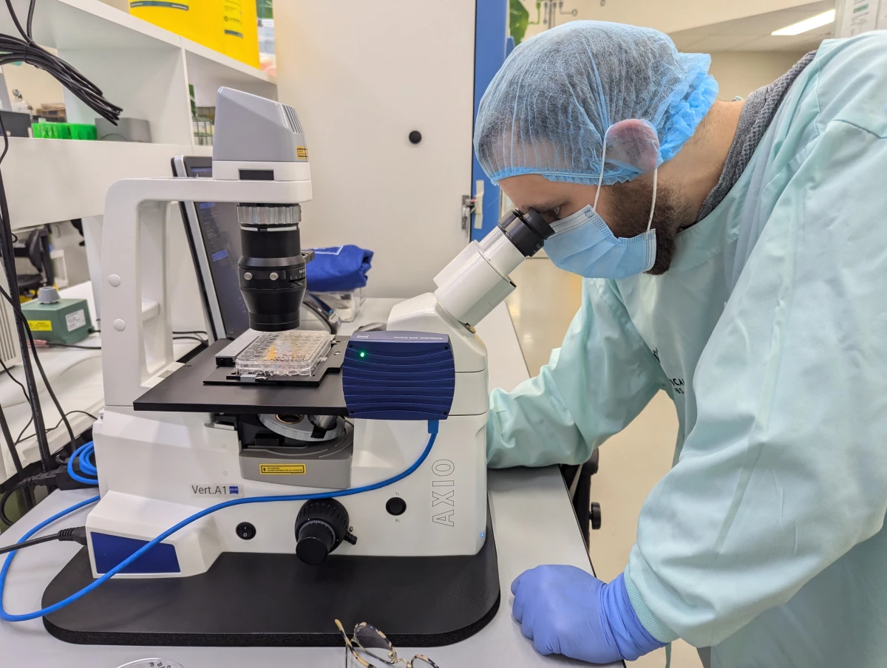
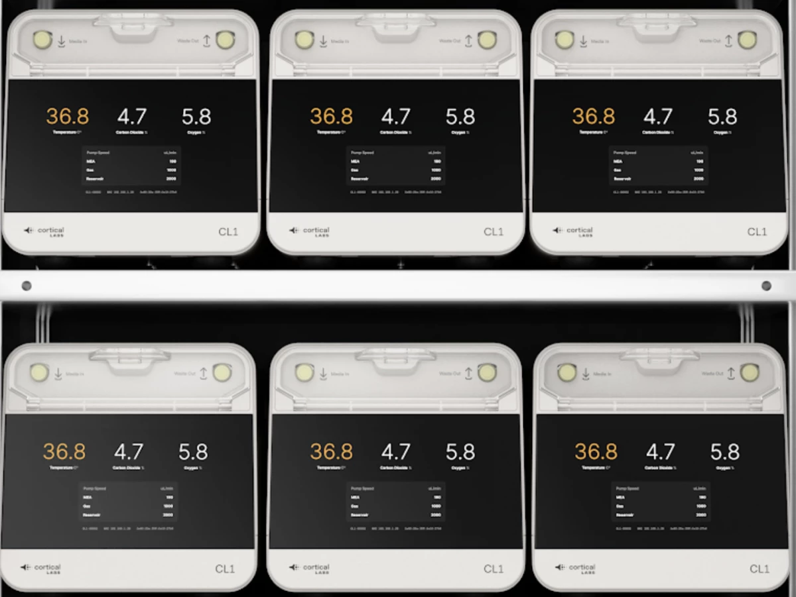

## 一、缸中之腦：CL1不需要外部的計算機

世界上第一台「生物計算機」已經商業推出，它融合了人類大腦細胞與矽硬件以形成流動的神經網絡，標誌著人工智能技術進入了一個新時代。澳大利亞公司Cortical Labs推出的CL1提供了一種全新的計算智能——一種比目前存在的任何AI都更動態、可持續和節能的智能——我們將在未來幾個月內看到它在用戶手中的潛力。

被稱為合成生物智能（SBI）的Cortical公司的CL1系統於2025年3月2日在巴塞隆拿正式推出，預計將成為科學和醫療研究的遊戲規則改變者。在矽「芯片」上形成的人細胞神經網絡本質上是一個不斷進化的有機計算機，其背後的工程師表示，它學習得如此迅速和靈活，以至於完全超越了用於訓練現有大型語言模型（LLMs）如ChatGPT的基於矽的AI芯片。

「今天是Cortical Labs願景的頂峰，這個願景已經持續了將近六年，」Cortical創始人兼首席執行官Hon Weng Chong博士說。「近年來我們經歷了一系列關鍵突破，最顯著的是我們在《Neuron》期刊上的研究，通過這項研究，我們讓細胞在模擬的遊戲世界中生長，並提供電生理刺激和記錄來模仿街機遊戲《Pong》。然而，我們的長期使命一直是使這項技術民主化，讓沒有專業硬件和軟件的研究人員也能接觸到它。CL1就是實現這一使命的產物。」他補充說，雖然這是一個開創性的進步，但只有在用戶手中使用時，才能看到SBI系統的全部潛力。

## 二、缸中之腦：生命支持系統與腦芯片

「我們正在提供『軟件即服務』（WaaS），」他補充說——客戶可以直接購買CL-1生物計算機，或者簡單地購買芯片使用時間，通過雲端遠程訪問它們來與培養細胞技術合作。「這個平台將使全球數百萬研究人員、創新者和思想家能夠將CL1的潛力轉化為切實的現實世界影響。我們將為他們提供平台和資金支持，以投資於研發並推動新的突破和研究。」

這些非凡的大腦細胞生物計算機有可能徹底改變從藥物發現和臨床試驗到機械人「智能」構建的一切，根據需求實現無限個性化。CL1將於2025年下半年廣泛上市，對於Cortical來說是一個巨大的成就——正如《新地圖》最近在訪問該公司墨爾本總部時所看到的——這裡的潛力比《乒乓》要深遠得多。

該團隊在2022年開發了一個自適應計算機「大腦」，通過將80萬個人類和老鼠神經元放置在芯片上，並訓練這個網絡玩視頻遊戲，從而登上了國際頭條。新阿特拉斯的讀者可能已經熟悉Cortical Labs及其向SBI的逐步發展，洛茲·布萊恩曾報道了這個能夠調整和適應以形成新的、對刺激響應的信息處理路徑的自適應神經網絡的早期進展。

首席科學官布雷特·卡根（Brett Kagan）在2023年告訴布萊恩：「我們幾乎將其視為一種不同的生命形式，比如說動物或人類。我們認為這是一種機械和工程方法來處理智能。我們正在使用生物神經元作為智能的基底，但我們以新的方式組裝它們。」

自那重要的一步以來，Cortical Labs已經走了很長一段路，但如今已不再使用的DishBrain在技術和名稱上都已經過時。現在，隨著CL1的商業化，研究人員可以親自接觸這項技術，並開始探索廣泛的真實世界應用。

去年年底，當《新地圖》雜誌的記者們在Cortical Labs墨爾本總部訪問了Kagan及其團隊時，我們親眼目睹了自DishBrain以來生物技術取得了多麼大的進步。CL1配備了相對簡單的、穩定的硬件，採用了新的方法來優化「濕件」——人類腦細胞——並且在構建一個像完整功能大腦一樣工作的神經網絡方面邁出了重要步伐。或者，正如Kagan解釋的正在進行的「最小可行腦」項目。

## 三、缸中之腦：刺激反應

在2022年，該團隊展示了如何將基於互補金屬氧化物半導體（CMOS）技術的高密度多電極陣列（HD-MEA）中的小鼠和人類誘導的多能幹細胞（hiPSCs）電生理刺激，以形成自主的、高效的信息交換路徑。

為此，他們需要一種方法來獎勵表現出期望行為的腦細胞，並在它們未能完成任務時對其進行懲罰。在DishBrain實驗中，他們證明了可預測性是關鍵；神經元會尋找產生高效、可預測結果的連接，並將調整其網絡以尋求這種獎勵，同時避免產生隨機、混沌電信號的行為。

但是，正如卡根所解釋的，那只是開始。

卡根告訴布萊恩和我說：「現在的版本完全是不同的技術。之前的那個使用了一種叫做CMOS芯片的東西，它基本上可以給你一個非常高密度的讀取，但是它是不透明的，你看不見細胞。還有其他問題——比如，當你用CMOS芯片刺激時，你不能提取電荷；你也不能很好地平衡電荷。結果就是在長時間刺激的地方積累了大量電荷，這對細胞來說是非常糟糕的。」

「有了這些版本，它們是一種更簡單的技術，但這意味著它們更加穩定，你能夠更積極地平衡電荷，」他補充說。「當你輸入兩微安的電流時，你可以提取出兩微安的電流。並且你可以保持它更穩定更長的時間。」

## 四、缸中之腦：實驗室培養幹細胞

在CL1系統中，實驗室培養的神經元被放置在平面電極陣列上——或者，正如Kagan所解釋的，「基本上就是金屬和玻璃。」在這裡，59個電極構成了一個更穩定的網絡基礎，為用戶提供了一種高度控制激活神經網絡的能力。然後，這個SBI「大腦」被放置在矩形的生命支持單元中，該單元隨後連接到一個基於軟件的系統，以便實時操作。

灌注迴路組件充當細胞的生命支持系統——它具有廢物過濾、溫度控制、氣體混合以及泵來保持所有東西的循環。

在實驗室裡，Cortical正在組裝這些單元來構建一個前所未有的生物神經網絡服務器堆棧，該堆棧包含30個單獨的單元，每個單元都包含了其電極陣列上的細胞，預計將在未來幾個月內上線。

該團隊的目標是年底前通過雲系統讓四台這樣的堆棧運行並可供商業使用。預計這些單元本身的起價為大約35,000美元（目前接近此類技術的價格約為80,000歐元，或近85,000美元）。

整個CL1單元使用大約850-1,000瓦的能量，完全可編程，並提供「雙向刺激和讀取接口，旨在實現神經通信和網絡學習」，團隊在他們的發布聲明中指出。令人難以置信的是，CL1單元也不需要外部計算機來操作。

## 五、缸中之腦：矽硬件上生活的細胞

複雜的、不斷進化的SBI神經網絡——在顯微鏡下可以看到它們從電極到電極形成分支——最初有潛力徹底改變藥物發現和疾病建模的研究方式。

卡根說：「我們的目標是使其價格大幅降低，我們確實希望從長遠來看能降低定價，但那是一個更長期的目標。與此同時，我們通過基於雲的系統向任何地方、任何人、任何家庭提供訪問權限。」

「所以即使你沒有這些[單元]之一，」他補充說，「你也可以從家裡訪問其中一個。」

卡根帶我們參觀了物理隔離級別（PC2）實驗室——這裡既有計算機硬件，也有更傳統的生物標本和設備。在顯微鏡下，他向我們展示了一些至關重要的誘導多能幹細胞（iPSC）。這些細胞是從血液樣本中培養出來的，本質上是空白的畫布，可以生長成不同類型的細胞。

「我們做的是將這些細胞取出來，然後開始使用兩種不同的方法來區分它們，」他解釋說。「一種方法是應用小分子，這被稱為發育分化協議，我們基本上試圖模仿在子宮內或胎兒發育大腦中發生的分子。另一種方法是直接對它們進行分化，選擇上調參與神經元的特定基因。」

該團隊的方法之一是快速且能產生高水平的細胞純度，然而缺點在於它並不完全代表人類大腦。

卡根說：「大腦不是一個高純度的器官；它有很多不同的細胞類型，很多不同的連接。所以如果你只有一個細胞類型，你可能會有那種細胞類型，但你沒有大腦。」

## 六、缸中之腦：每節內的活性細胞

第二種方法，「小分子方法」，會產生多樣化的細胞群體，但通常不清楚它們具體在研究什麼。而理解這一點對於Cortical雄心勃勃的持續追求構建最小可行大腦至關重要。雖然CL1的啟動是第一步，但團隊也在努力進行SBI的第二階段工作。

「你可以對主要細胞進行分類，但總是有很多亞型——這真的很好，正如我們所發現的，但我們真的很希望有完全控制的直接分化，」他解釋說。「我們還沒有解決這個問題：什麼是『最小可行大腦？』」

多能幹細胞（MVB）是一個令人感興趣的概念：如何生物工程化一個類似人類「大腦」的「大腦」，同時盡量減少多餘的細胞分化，但又要具有由同質細胞類型組成的神經網絡所不具備的複雜性。這樣的工具將是一個強大的模型，允許進行比目前對真實大腦研究更精確和細緻的分析。

「基本上，關鍵的生物組成部分是允許某物根據底層原則以動態和響應的方式處理信息，」卡根解釋說。「單個神經元可以做很多事情，雖然它可以對某種程度的動態行為做出反應，但它不能，例如，導航環境。我們所知最小的功能大腦有301或302個神經元——這取決於你問誰——這是在C. elegans中。但每個神經元都是高度特定的。」

## 七、缸中之腦：矽芯片上腦細胞輸入與輸出

「另一個問題是：C. elegans的大腦是最小可行大腦嗎？你需要所有的神經元，還是可以用30個獨特連接的神經元來實現？」他繼續說。（這個生物當然是科學界最喜歡的線蟲，Caenorhabditis elegans。）如果是這樣的話，你能用10萬個相同的30構建一個更複雜的網絡嗎？我們目前還不知道這些問題的答案，但有了這項技術，我們可以揭示它們。

他說：「我們正在逐步增加越來越多的細胞類型到這種培養中，但有一件事阻礙了我們前進的步伐，那就是工具。在建造了[CL1]單元之前，它並不存在，你需要像那樣的工具來回答這樣的問題，『什麼是最小可行的大腦？』如果你有120個單元，你可以設置非常受控的實驗來確切了解是什麼驅動著智能的出現。你可以將其分解到轉錄組和基因水平上，以了解哪些基因和蛋白質實際上推動一個人學習而另一個人不學習。當你擁有所有這些單元時，你就可以立即開始採取藥物發現和疾病建模的方法。」

這對於研究更好的治療方法甚至治愈癲癇和阿爾茨海默病等腦部疾病以及其他與大腦相關的疾病尤為重要。與此同時，CL1系統有望大大推進對疾病和治療的研究。

他解釋說：「大多數進入臨床試驗測試的神經和精神疾病藥物都失敗了，因為大腦的問題要複雜得多——但是當你使用這些工具進行測試時，你實際上可以看到這種複雜性。我們希望我們能夠用這些工具取代大量的動物測試。不幸的是，動物測試仍然是必要的，但我認為在許多情況下它可以被取代，這是一個倫理上好的事情。」

這項技術的倫理問題一直是Cortical關注的焦點——那篇2022年的突破性論文引發了大量的辯論，特別是在人類「意識」和「感知」領域。然而，儘管已經盡可能多地設置了護欄，用於規範CL1單元的倫理使用和遠程WaaS訪問，仍有許多工作要做。

## 八、缸中之腦：腦細胞構成的人工智能

「根據地點和具體用例，需要獲得許多監管批准，」該團隊在其啟動聲明中指出。「監管機構可能包括衛生機構、生物倫理委員會以及負責監督生物技術或醫療器械的政府機構。遵守這些法規對於確保生物計算技術的負責任和倫理使用至關重要。」

但是作為這項雄心勃勃技術的全球領先者，Cortical知道——就像非生物人工智能的快速發展一樣——預測SBI的廣泛應用並不容易。公司面臨的另一個挑戰是資金問題——實現CL1作為一種切實可行的技術可能會改變這一點。

「我一直在聽投資者說的一個困難是，我們不符合任何類別，」Kagan在脫下實驗室外套、髮網和口罩後告訴我們，然後他搬到了樓上的計算機房旁邊的一張沙發上。「我們不是——我們是一種跨越多個不同邊界的科技。如果你看優先領域，我們可以涵蓋從生物技術、機械人技術、醫學科學等一系列其他領域的賦能能力。我們既不是人工智能，也不是醫學——我們可以做人工智能也可以做醫學，但我們都不是。所以我們經常被排除在外。」

## 九、缸中之腦：CL1單元內的生命支持系統

因此，物理CL1系統和Cortical雲WaaS遠程使用的推出是一項巨大的成就，Kagan及其團隊非常興奮地看到SBI一旦進入人們手中可以走多遠。

「CL1是第一款商業化的生物計算機，它被獨特地設計用於優化與體外神經培養物的通信和信息處理，」團隊指出。「CL1內置生命支持系統以維持細胞的健康，在醫學科學和技術領域具有重大的潛力。

「SBI本質上比人工智能更自然，因為它利用了與生物體智能相同的生物材料——神經元，」Cortical補充說。「通過將神經元作為計算基礎，SBI有可能創造出與傳統矽基人工智能相比，展現出更加有機和自然的智能形式。」

>來源：Cortical Labs  
>原文連接：
>https://newatlas.com/brain/cortical-bioengineered-intelligence/